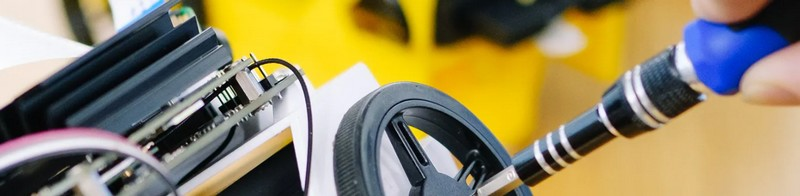
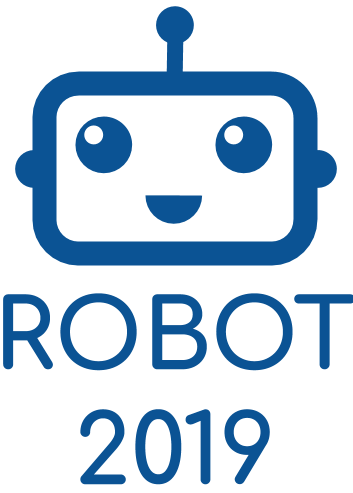
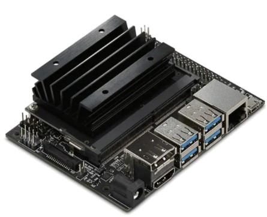
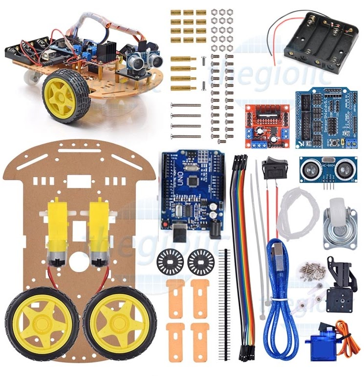

# ASA session II

From November 11th, 2019 to February 10th, 2020 we had 9 sessions to create and improve our robot cars. Some work is shared here.

## Arduino

For the Arduino C programs we use the folder [arduino](./arduino). For example:

- [Ultrasonic](https://github.com/kreier/asa2/blob/master/arduino/ultrasonic.ino)
- [Ultrasonic with beep](https://github.com/kreier/asa2/blob/master/arduino/ultrasonic_beep.ino)
- [Ultrasonic results on 1602 display](https://github.com/kreier/asa2/blob/master/arduino/ultrasonic_1602_buzzer.ino)
- [Servo control](https://github.com/kreier/asa2/blob/master/arduino/servo.ino)
- [Bluetooth connection beep confirmation](https://github.com/kreier/asa2/blob/master/arduino/bluetooth_beep.ino)
- [T300 software from January 13th, 2020](https://github.com/kreier/asa2/blob/master/arduino/T300_20200113.ino)

## MicroPython

Our first steps in MicroPython are documented in the [micropython](./micropython) folder.

## Schedule

- 2019-11-11 Start with Chung N, Yau, Sean and Huy
- 2019-11-18 Huy programs his Alexa clone on [OrangePi Zero](http://www.orangepi.org/orangepizero/)
- 2019-11-25 Huy wants to investigate Machine learning and object detection. Jetson Nano?
- 2019-12-02 [hackster.io](https://www.hackster.io/) has a competition to win a free [Jetson Nano](https://www.hackster.io/contests/NVIDIA) with __AI at the Edge__ challenge
- 2019-12-09 More ultrasonic parts finished, Yau has his robot driving - ready to participate in the [Robot 2019 competition](https://sites.google.com/ais.edu.vn/robot2019)
- 2020-01-06 Update remote control with bluetooth from the smartphone
- 2020-01-13 [Chuong N](https://github.com/ChuongN) uploads the first update to [Bluetooth Beep](https://github.com/kreier/asa2/blob/master/arduino/bluetooth_beep.ino)
- 2020-02-03 School was canceled yesterday because of COVID19
- 2020-02-10 Closed schools extended by one week

